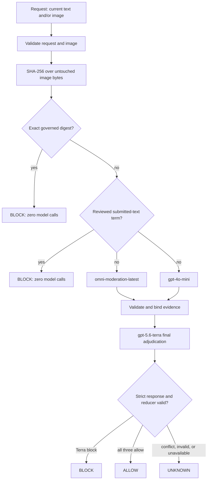

# Minimal SHA-256 + AI moderation architecture

Status: architecture candidate; production release requires held-out
calibration and deployment controls

Policy contract: `minimal-sha-ai-v1`

## Objective

Moderate current posts, comments, usernames, and images without allowing a
similar background to copy an earlier image's decision. There is no human
review state. `gpt-5.6-terra` is the automated adjudicator, and unresolved
evidence produces the terminal synchronous result `UNKNOWN`.

## Components

The runtime has one public Spring Boot service and no internal network hops:

- request and image validation;
- original-byte SHA-256 plus an immutable exact-reference catalogue;
- immutable, reviewed moderation terms;
- an OpenAI adapter restricted to `omni-moderation-latest`, `gpt-4o-mini`, and
  `gpt-5.6-terra`;
- strict response validation and a single final policy decision.

There is intentionally no database, OCR engine, PDQ/perceptual hash, ORB/local
feature index, visual-retrieval process, or human-review queue.

## Request flow



The two base analyzers run concurrently. Terra runs for every request not
resolved by an exact hash or deterministic term. This prevents a base-model
allow from hiding text such as `PORN` visibly embedded in an image. Safety is
evaluated before any optional business classification.

## Non-negotiable invariants

1. SHA-256 is computed once over the original upload bytes before decoding or
   transformation.
2. Only equality with a pre-governed exact catalogue entry may block by hash.
3. Re-encoded, resized, cropped, metadata-edited, or text-edited bytes are not
   an exact match and are judged as current content by the models.
4. No request, model result, or blocked upload can add or update a reference or
   term.
5. Deterministic term rules inspect submitted text only. Model-reported
   `visibleText` never activates a deterministic term rule.
6. The only provider models are the three hard-coded IDs. Model substitution,
   missing response identity, malformed JSON, trailing content, or invalid
   enums invalidates the evidence.
7. Responses API storage is disabled (`store: false`); retention for every
   provider endpoint remains a deployment/privacy contract. Raw images,
   submitted text, model-visible text, keys, and full provider responses must
   not be logged.
8. An unavailable or invalid required analyzer produces `UNKNOWN`, never an
   implicit allow or policy block.
9. `ALLOW` requires category `NONE`; `BLOCK` requires a blockable category;
   `UNKNOWN` requires `UNDETERMINED` and confidence exactly `0.0`.
10. Image responses bind the decision to the lowercase original-byte digest
    and `EXACT_MATCH` or `NOT_MATCHED`.
11. Terra may add a block missed by both base models. Terra may return `ALLOW`
    only when omni is unflagged and 4o-mini also returns a valid `ALLOW`;
    material disagreement returns `UNKNOWN`.
12. Provider calls require the explicit `OPENAI_ENABLED` spend switch as well
    as a key, and the in-process concurrency gate bounds simultaneous paid
    pipelines.

## Why perceptual similarity is excluded

Perceptual similarity describes appearance, not policy identity. An attacker
can preserve a background while replacing the overlay that made a reference
harmful; conversely, a benign replacement can remain perceptually close to a
blocked asset. Directly blocking either case from similarity creates false
allows or false blocks.

The minimal system therefore has two clear paths:

| Signal | Meaning | May block directly? |
|---|---|---:|
| Exact SHA-256 equality | The upload bytes equal a governed prohibited asset | Yes |
| Moderation term | Submitted text hits a reviewed context-free rule | Yes |
| Visual/text model evidence | A model judged the current request | Only after Terra's valid final adjudication |

The tradeoff is explicit: transformed known images are not detected by hash.
They depend on current-content model performance. A future retrieval system may
propose candidates, but it must never restore similarity-only blocking.

## Configuration governance

Exact references use:

```text
REFERENCE_ID|SHA256|CATEGORY|LANGUAGE
```

Terms use:

```text
CATEGORY|LANGUAGE|TERM
```

Configuration is strict UTF-8, bounded, loaded once, and immutable during the
process lifetime. Parsers reject invalid field counts, identifiers, lowercase
hash shape, categories, languages, controls, duplicates, and boundary-unsafe
terms. Whole-line comments and blank lines are the only ignored input. Empty
governed files are valid. Term language is rule metadata, not detected
whole-content language; deterministic term responses therefore use `und`.
When several distinct terms match, the first governed row determines the
reported category, and row order is included in the policy fingerprint.

Production must version these files as policy artifacts, require approval for
changes, and roll back the full policy/model/prompt unit—not an individual
field. Every response includes `policyFingerprint`, derived from both
catalogue digests, both prompt digests, the fixed model IDs, reducer version,
and operator policy version.

## Response semantics

The response returns `decision`, final `category`, `confidence`, detected
`language`, and a content-derived `policyFingerprint` for every moderation
request. Image requests additionally
return original-byte `imageSha256`, `imageMatch`, and optional AI-reported
`visibleText`.

`confidence: 1.0` on exact and term decisions means the deterministic rule or
identity comparison is certain; it does not claim that policy authorship is
infallible. AI confidence is bounded input to monitoring and calibration, not
a universal probability shared across categories and languages. This candidate
uses a fingerprinted `0.80` minimum for conclusive Terra decisions and for the
4o-mini allow leg; lower confidence becomes `UNKNOWN`. The threshold must be
recalibrated against the held-out release set before production approval.

## Failure and retry contract

Because there is no human queue, `UNKNOWN` must be a first-class caller state.
A caller may retry under a bounded idempotent policy, quarantine content under
its own documented product policy, or reject the operation. It must not silently
turn `UNKNOWN` into `ALLOW`.

Before production retries, add tenant-bound idempotency and durable result
caching so a transport retry cannot repeat paid model calls. Apply separate
request, byte, concurrency, rate, timeout, and spend limits.

## Required offline verification

- known SHA-256 vector, exact equality, one-byte difference, and re-encode
  difference;
- exact and deterministic-term decisions invoke zero provider clients;
- no upload ever mutates or auto-enrolls in either catalogue;
- malformed, duplicate, oversized, or unsafe catalogue input fails startup;
- Unicode normalization and word/phrase boundary behavior for terms;
- corrupt, mismatched MIME, unsupported, oversized, over-dimension, over-pixel,
  and animated image rejection;
- provider request model IDs, `store: false`, strict schemas, and timeouts;
- wrong model, malformed/duplicate/trailing JSON, refusal, timeout, and partial
  output return `UNKNOWN`;
- regression where both base analyzers allow an image containing harmful visible
  text and Terra returns `BLOCK / SEXUAL`;
- response invariants for decision/category/confidence/language/image fields;
- Compose contains exactly one service and no database, OCR, media, or visual
  retrieval dependency.

Offline tests must use a fake provider endpoint. Any live evaluation must have
a separate explicit API-spend approval gate and an immutable evaluation-set
digest.

## Production release gates

Architectural approval requires measurable held-out results, not only unit-test
coverage:

- zero hash-only false blocks on same-background/different-text pairs;
- agreed false-allow, false-block, and `UNKNOWN` budgets per language/category;
- transformed-image cases for recompression, resize, crop, rotation, filter,
  low contrast, occlusion, and changed overlays;
- model/prompt changes evaluated in shadow with rollback criteria;
- authenticated tenant identity, authorization, rate/spend controls, secret
  management, regional/privacy policy, and abuse monitoring;
- correlated telemetry for decision/category/language/confidence, deterministic
  rule identity, model latency/failure/contract validity, and policy version;
- declared SLOs, incident behavior, and a documented caller policy for
  `UNKNOWN`.

Until these are approved and measured on production-representative held-out
data, this implementation is an architecture-ready minimal system, not a claim
of calibrated production safety.
