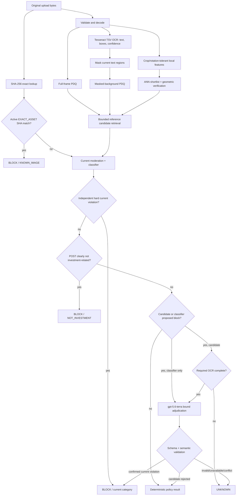

# Policy-aware image moderation

Status: local candidate-retrieval gate is **PASS**; production release is **NO-GO** pending held-out calibration, approved model-backed validation, and deployment security controls

Policy contract: `image-policy-v1`

Automated adjudicator: `gpt-5.6-terra` through the OpenAI Responses API

Adjudication contract: `image-adjudication-v2`

## Executive decision

PDQ is a retrieval index, not an identity system and not a moderation rule. A similar image can reuse the same background while replacing the words that made an earlier image harmful. Therefore a PDQ hit only finds reference candidates. The service re-evaluates the current upload's bytes, pixels, OCR, text, and composition before it can block.

There is no human-review state. When required evidence or the automated adjudicator is unavailable, incomplete, or contradictory, the synchronous terminal result is `UNKNOWN`. The caller may retry under its own bounded policy; it must not convert `UNKNOWN` into `ALLOW`.

The first controlled live run on 2026-08-03 is intentionally retained as a failed release gate: 64 cases, 96.875% decision accuracy, no harmful allows, two benign false blocks, and only 32.8125% intended retrieval coverage. The result proves that single-frame PDQ is insufficient for the declared crop/rotation envelope and that a non-deterministic classifier block must be verified. It predates the final v2 classifier-block recheck and integrated visual-retrieval path, so it is diagnostic evidence, not a claim that the new path passes. Neither gate is weakened to make the demo pass.

## Non-negotiable invariants

1. SHA-256 is computed directly over the untouched original upload bytes, without decode-time canonicalization. Only equality with an active `EXACT_ASSET` reference may directly produce `BLOCK / KNOWN_IMAGE`.
2. A PDQ or masked-PDQ distance never directly changes a decision. It only retrieves at most the configured candidate limit.
3. `TEXT_DEPENDENT` and `COMPOSITION_DEPENDENT` candidates require successful, non-truncated OCR of the current image.
4. Reference text, OCR, hashes, labels, and IDs are untrusted data. They are never inserted into a developer instruction.
5. Unless an authoritative original-byte exact match short-circuits the decision, the current image is sent to current-content analysis. Reference conclusions are not copied to the current upload.
6. A non-deterministic image-classifier `block` is a proposed block. Terra must confirm it, reject it, or return `UNKNOWN`; it is not terminal by itself.
7. Terra output is accepted only when it passes JSON Schema and application-side semantic validation. Candidate IDs must equal the complete bounded retrieved set for candidate modes and must be empty for classifier-only mode.
8. A valid Terra `allow` cannot override an exact-asset rule, a deterministic local rule, or a designated hard current-content moderation block.
9. Missing media, OCR, classifier, retrieval, or required adjudicator evidence returns `UNKNOWN`; no candidate may cause a fail-closed block by itself.
10. Reference activation is a separate, controlled operation. Runtime model decisions never auto-promote an upload into the reference set.
11. Policy, model, prompt, OCR, decoder, fingerprint/descriptor implementation, and thresholds are versioned decision inputs.

## Request flow

The masked fingerprint can help find a reused template, but it remains retrieval-only. It deliberately removes current OCR regions so that changed overlay words do not cause the background lookup itself to decide policy. Controlled ablations also showed that OCR-derived masking is not stable enough to be the only background-search channel: applying Tesseract boxes to ORB features reduced intended rank-1 recall to 35–36/64 and raised cross-template relations above 91%. That method is explicitly rejected, not silently enabled.

The local ORB service therefore uses unmasked local features only as another bounded candidate source. Every geometrically valid match in the bounded LSH shortlist is ranked before specificity is decided. The service emits only rank 1 when its homography-inlier lead over rank 2 is at least 12 (an absent runner-up counts as zero); otherwise it emits no ORB candidate. This governed rule is `orb-homography-specificity-v1`. The result is merged by immutable reference ID with PDQ candidates and capped at five. Even a strong ORB match never sets `matched`, `blocked`, or a final category. High candidate fan-out is a cost/latency defect and a release-gate failure, but it cannot become a hash-only policy decision.

## Reference semantics

| Decision basis | What the reference means | Required current evidence | Direct block allowed |
|---|---|---|---|
| `EXACT_ASSET` | These exact original bytes are an immutable prohibited asset | Original-byte SHA equality and active compatible policy | Yes |
| `VISUAL_REGION` | A specific visual region was prohibited | Current pixels and automated visual adjudication | No |
| `TEXT_DEPENDENT` | Visible words caused the reference decision | Current OCR, current pixels, current classifier, Terra | No |
| `COMPOSITION_DEPENDENT` | The combination of background, subject, and words caused it | Current OCR, current pixels/context, Terra | No |

Legacy `blocked_pdq_hashes` records have no trustworthy decision basis. They are exposed only as non-authoritative composition candidates until explicitly migrated.

## Deterministic decision order

| Condition | Result |
|---|---|
| Invalid, oversized, unsupported, animated, or unsafe image | Validation error (4xx), not a moderation decision |
| Active `EXACT_ASSET` has identical original-byte SHA | `BLOCK / KNOWN_IMAGE` |
| Current moderation service flags current content | `BLOCK / current category` |
| Deterministic username/comment policy blocks | `BLOCK / local category` |
| Mandatory current analyzer is unavailable | `UNKNOWN / ANALYZER_ERROR` |
| A trusted POST classification is clearly `investment=not_related` | `BLOCK / NOT_INVESTMENT` without Terra |
| Non-deterministic image classifier proposes block | Require Terra classifier-block recheck |
| Terra rejects the proposed classifier block and no hard signal remains | Continue ordinary policy / `ALLOW` |
| Terra cannot resolve a proposed classifier block | `UNKNOWN / EVIDENCE_UNAVAILABLE` |
| Current classifier is uncertain and no other resolution exists | `UNKNOWN` |
| Similar candidate needs OCR and OCR is disabled, busy, failed, low-confidence, or truncated | `UNKNOWN / EVIDENCE_UNAVAILABLE` |
| Similar candidate and Terra confirms a current violation | `BLOCK / adjudicated category` |
| Similar candidate and Terra rejects the candidate for the current content | Continue the ordinary current-content policy |
| Terra timeout, refusal, invalid JSON/schema, or unavailable response | `UNKNOWN / EVIDENCE_UNAVAILABLE` |
| Terra returns an internally inconsistent `ok` contract, wrong mode, or wrong candidate IDs | `UNKNOWN / ANALYZER_ERROR` |
| No blocking/uncertain evidence remains | `ALLOW / NONE` |

### Cost-safe short circuits

The runtime avoids model calls when the result is already determined or cannot be made valid:

- an authoritative original-byte exact match is audited and blocked without invoking image moderation, classification, or Terra;
- a failed mandatory media analysis returns unavailable evidence without invoking image models;
- a hard current-content moderation block does not invoke Terra;
- a failed mandatory moderation or classification signal does not invoke Terra, because the final result is already `UNKNOWN`;
- a trusted POST classification of `investment=not_related` is already a terminal policy block and does not invoke Terra, even when a visual candidate or image-classifier proposal exists;
- missing, low-confidence, or truncated OCR required by a retrieved candidate suppresses Terra and returns unavailable evidence;
- the live evaluator cannot send gateway requests until its explicit API-spend confirmation flag is supplied.

These are decision-preserving optimizations, not weaker screening. Any code path that still needs current-content judgment retains the full current-image checks.

Base analyzer evidence is contract-checked before it can become `status=ok`. Moderation requires one typed result, the complete governed 13-category minimum with matching finite scores, consistent `flagged` state, and a bound provider model. Custom classification requires the exact content-type field set, closed enum values, no duplicate or trailing JSON, and consistent action/category semantics. Partial or malformed evidence becomes `UNKNOWN`.

Flagged moderation categories are reduced with a fixed taxonomy priority, not
provider map iteration order. A custom classifier block may refine only an
approved generic provider category into a more specific policy category; it
cannot downgrade minors, hate, threatening, self-harm, or graphic-violence
evidence. Equal unflagged scores use the same deterministic priority and a
stable final tie-break. This governed fusion behavior is
`decision-reducer-v2`, recorded in every current decision-configuration
snapshot alongside the classification prompt and request-profile digests.

## Terra contract

The call uses `store: false`, original-detail image input, bounded current text, and a bounded list of candidate metadata. Reasoning effort is configurable and defaults to `medium`.

Strict output fields are:

- `adjudicationMode`: `candidate_recheck | classifier_block_recheck | both`
- `action`: `allow | block | unknown`
- `category`: closed policy enum
- `candidateDisposition`: `confirmed | rejected | inconclusive`
- `evidenceBasis`: `current_visual | current_text | composition | insufficient`
- `reasonCode`: closed operational enum
- `candidateIds`: every bounded retrieved ID exactly once for candidate modes; empty for classifier-only mode

Application validation enforces valid combinations and binds the response to the actual trigger. For example, `block` requires a non-`none` category, `confirmed`, and non-insufficient evidence; `allow` requires category `none` and `rejected`; `unknown` requires `inconclusive` and `insufficient`. A `both` response cannot clear a classifier proposal merely by citing reference-only similarity.

The provider response is also bound to the configured model. A pinned dated model must be returned exactly; an undated governed model such as `gpt-5.6-terra` may resolve only to itself or its dated `gpt-5.6-terra-YYYY-MM-DD` snapshot. A missing or different response model invalidates the evidence and produces `UNKNOWN`. The resolved model is recorded in the decision evidence for audit and rollback.

## Data and trust boundaries

- Keep the reference catalogue separate from observed upload hashes. Observing or blocking an upload does not insert a reference.
- Every reference records an immutable external ID, reference version, source type/reference, creating authority, activation time, policy version, decision basis, severity, and status.
- Bind client `contentId` to an authenticated tenant and a server-generated immutable artifact ID before production deployment.
- Store evidence digests and version metadata by default. Retaining raw images/OCR requires encryption, access control, a declared purpose, and deletion/retention controls.
- Authenticate service-to-service endpoints and isolate them on a private network. The local Compose demo does not provide an internet-facing security perimeter.
- Apply independent request, byte, pixel, OCR-concurrency, model-concurrency, and timeout limits.
- Reject unsafe or inconsistent configuration at startup: every service uses the same versioned envelope of 8 MiB per image file, 9 MiB per total multipart request, and 16,777,216 decoded pixels. An override cannot make an upstream accept content the visual service must reject.
- Never log raw image bytes, post text, OCR text, API keys, or full provider responses.
- Persist final image decisions synchronously in the append-only audit table. If that write fails, return 503 instead of returning an unaudited moderation decision.

The current v2 audit schema stores no image bytes, OCR text, or post text. Every new row carries a bounded canonical decision-configuration snapshot whose recomputed SHA-256 must equal its stored digest. That snapshot binds the policy and word list; exact, PDQ, masked-PDQ, OCR, decoder, and ORB implementations and thresholds; immutable visual-catalogue identity; gateway and analyzer timeouts; request/image limits; and configured AI provider/model/request contracts. The moderation, classification, and adjudication profile hashes cover the complete provider request and response contract, including endpoints, message roles and content types, prompts, schemas, image detail, token/reasoning limits, parser rules, and strict semantic response validation—not just prompt text.

Configured AI identity is retained separately from the service's observed canonical configuration. Each audited decision records `matched`, `mismatch`, `unavailable`, or `not_invoked`, plus the observed snapshot and digest when available. A mismatch cannot be accepted as evidence and makes the decision `UNKNOWN`, while preserving enough non-secret provenance to diagnose it. Migration V9 adds this v2 provenance without rewriting historical records: legacy rows remain explicitly labelled `legacy-v7`, new inserts must use `image-decision-provenance-v2`, and update, delete, and truncate are rejected by database triggers.

## Required telemetry

Emit correlated metrics and audit events for:

- final decision, violation, resolution basis, policy version, and request ID;
- exact SHA hit and reference ID;
- candidate count, fingerprint type, and distance distribution;
- OCR status, latency, confidence/coverage, language set, truncation, and engine version;
- classifier/moderation disagreement;
- Terra invocation, model/prompt version, latency, contract-validity, result, and unknown rate;
- database/index revision and rebuild latency;
- false-block, false-allow, and unknown rates by language, transformation, and decision basis.

## Release gates

The local evaluator contains paired same-background/different-text cases because aggregate accuracy can hide the exact false-positive failure this design fixes. A release must pass all of these gates on a held-out, immutable manifest:

- zero hash-only blocks;
- zero false blocks for blocked-background-to-benign-text pairs;
- zero false allows for benign-background-to-harmful-text pairs;
- per-language and per-transformation false-block/false-allow budgets agreed with policy owners;
- explicit maximum `UNKNOWN` rate and Terra-unavailable behavior;
- regression coverage for crop, recompression, resize, rotation, filter, low contrast, and occlusion;
- prompt/model/OCR/policy changes evaluated in shadow before activation, with rollback to the prior complete version set.

### Current local evidence

| Evaluation | Result | Gate |
|---|---:|---|
| Paired offline exact/background proof | 4/4 naive hash-only false blocks reproduced | Demonstrates the defect |
| Pre-integrity live gateway diagnostic | 62/64 decisions correct; 0 harmful allows; 2 benign false blocks | **FAIL — not release evidence** |
| Pre-integrity live single-frame PDQ/masked-PDQ retrieval | 21/64 (`32.8125%`) | **FAIL — not release evidence** |
| Strict bounded multi-view PDQ diagnostic | 56/64 with zero cross-template relations | **FAIL** |
| Raw ORB + homography diagnostic | intended reference ranked first in 64/64; 59/192 cross-template relations; p95 1303 ms exhaustive | **FAIL** |
| Tesseract-box ORB exclusion | rank first in only 35–36/64; 176–178/192 cross-template relations | **REJECTED** |
| Strongest full-recall geometric guard | rank first in 64/64; cross-template reduced only to 50/192 | **FAIL** |
| Governed integrated Java media + FastAPI retrieval | 64/64 contract pass; recall@1 64/64; ORB-only 60/60; four exact-SHA short-circuits; candidate p95/max 1/2; p95 3334 ms; cross-template 1/192 (`0.52%`) | **PASS — local retrieval only** |

The integrated media-only run is API-spend-free and byte-bound to the immutable local corpus: manifest SHA-256 `db34846fc23573d8db7172a85094e2802a94d6bd8abc73aba51884258c8087b1`, corpus SHA-256 `832e849f82a1d8f4cf58a2ac98069a9d24745c6d8609650fe45d6ce017d0d4ee`. It proves the candidate-only contract, exact-SHA behavior, intended retrieval, governed specificity rule, and real Java-to-FastAPI multipart path. It is not production approval: the four references and thresholds are evaluated on the same synthetic corpus, not a separately governed, production-representative held-out set. Final current-content adjudication remains mandatory regardless of retrieval quality.

Network-disabled unit and contract suites pass 198/198 tests: gateway 102, media 61, AI adapter 35. The visual engine's full suite passes 24/24 tests; its production-image core was also freshly rechecked offline through the dependency-free fallback at 19/19. The local evaluation utilities pass 14/14. The model-backed 64-case gateway gate was deliberately not rerun because no API-spend approval was granted; no provider quota was consumed by this evidence refresh.

The saved failed live report predates per-image manifest hashes and is retained only as diagnostic history; it cannot satisfy the immutable-corpus release gate. A future live rerun will bind every image byte through the corpus digest and requires explicit approval because it consumes configured model API quota. The evaluator refuses to start without an explicit confirmation flag.

## Remaining deployment decisions

Architect approval is still required for tenant identity, reference-authoring authority, policy-version compatibility, encrypted evidence retention, regional processing, SLOs/cost budgets, and the numerical release thresholds. These are organizational inputs rather than safe defaults the code can invent.

The explicit release blockers are:

- protect every internal analyzer/audit route with workload identity (mTLS or signed service credentials), authorization, rate limits, and model-cost quotas; the local Compose network is not that boundary;
- add tenant-bound idempotency, a durable outbox/result cache, and durable decision/audit persistence before retries are enabled, so an audit timeout or repeated client request cannot repeat paid model calls;
- calibrate no-match behavior, hard negatives, crop/rotation coverage, fan-out, latency, and uncertainty on a production-representative held-out set and the real reference-index scale;
- run the immutable 64-case gateway gate and the held-out gate with the configured provider models after explicit API-spend approval;
- pin runtime images and OCR packages by immutable digest/exact package version, then verify the audited Tesseract/decoder profiles in the deployment attestation.
